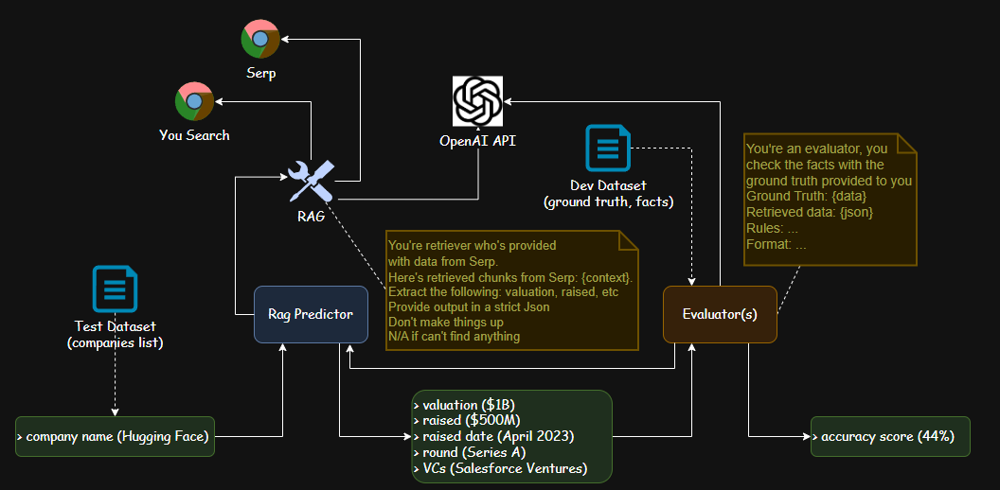
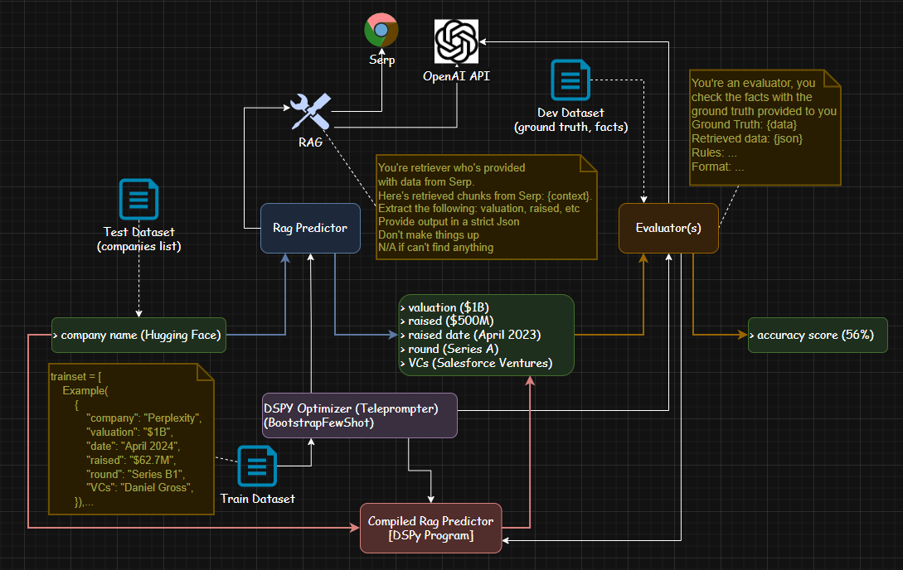
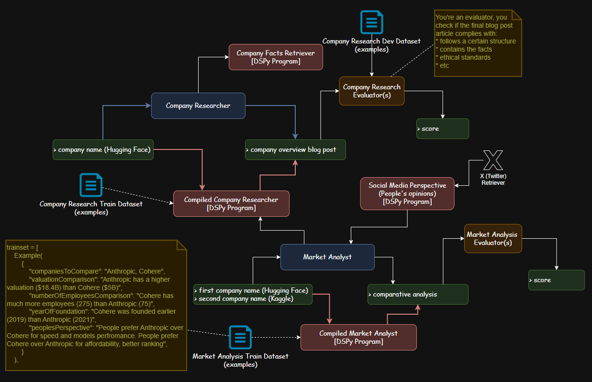

# DSPy Research and Demo

## Abstract
This repository is a comprehensive resource for experimenting with DSPy—a framework for declarative language model pipelines. It includes code, Jupyter notebooks, runnable demos, tests, and documentation for evaluating, orchestrating, and optimizing LLM workflows. The materials support research and practical exploration of DSPy’s approach to efficient, scalable, and self-improving AI systems.

## Motivation & Background

Traditional prompt engineering for LLMs is limited by manual trial-and-error, lack of reproducibility, and poor scalability. DSPy reframes LLM orchestration as a machine learning problem—using datasets, evaluation metrics, and hyperparameter optimization to automate and improve pipeline design.

**Key Insights ([YouTube walkthrough](https://www.youtube.com/watch?v=NXI2l0wJNBY&ab_channel=IliaZlobin)):**

- **Limitations of Prompt Engineering:** Manual, brittle, hard to scale, and resource-intensive.
- **DSPy’s ML Mindset:** Treats LLM pipelines as trainable programs, enabling systematic evaluation, optimization, and reproducibility.
- **Benefits:**
	- Higher efficiency and scalability.
	- Lower resource requirements (fewer API calls, less manual tuning).
	- Modular composition for building complex systems.

## Demos

Explore the following system architecture diagrams for DSPy pipelines:
-  – **Basic Company Analysis Pipeline (No Compilation):**  
  This diagram shows a straightforward DSPy pipeline for company analysis using declarative modules and prompt engineering. The workflow processes inputs and generates outputs without automated optimization, illustrating the baseline approach before leveraging DSPy’s compilation features.

-  – **Compiled & Optimized Company Analysis Pipeline:**  
  Here, the pipeline incorporates DSPy’s compilation and optimization capabilities. Prompts and module parameters are automatically tuned using datasets and evaluation metrics, resulting in improved accuracy and efficiency for company analysis tasks.

-  – **Comprehensive Multi-Stage Pipeline with Composable Compiled Programs:**  
  This diagram presents an advanced DSPy workflow for company and market analysis. Multiple compiled and optimized modules are composed to handle diverse subtasks—such as fact retrieval, social media analysis, comparative evaluation, and scoring. The architecture demonstrates scalable composition, iterative improvement, and robust evaluation across the pipeline.


## Related Papers

- [DSPy: Compiling Declarative Language Model Calls into Self-Improving Pipelines](https://arxiv.org/abs/2310.03714) – Introduces DSPy’s core concepts and compilation approach.
- [DSPy Assertions: Computational Constraints for Self-Refining Language Model Pipelines](https://arxiv.org/abs/2312.13382) – Explores evaluation and self-refinement in DSPy pipelines.

## Repository Structure

- **notebooks/** – Jupyter notebooks with DSPy examples:
	- Financial info retrieval
	- Company valuation
	- Market analysis
	- RAG (Retrieval-Augmented Generation)
	- Program composition and evaluation
- **dspy/** – Core DSPy framework modules, primitives, adapters, and utilities.
- **examples/** – Runnable Python demos for DSPy modules and pipelines.
- **tests/** – Validation code for modules, signatures, and optimizers.
- **Supporting configs:**
	- `requirements.txt`, `pyproject.toml`, `setup.py` – Dependency and environment management.
	- `docs/` – Documentation, diagrams, and API references.

## Setup Instructions

1. **Python Environment**
	 - Recommended: Python 3.8+
	 - Create a virtual environment:
		 ```bash
		 python -m venv .venv
		 source .venv/bin/activate
		 ```
2. **Install Dependencies**
	 - With pip:
		 ```bash
		 pip install -r requirements.txt
		 ```
	 - Or with Poetry:
		 ```bash
		 poetry install
		 ```
3. **Jupyter/Conda Setup (Optional for notebooks):**
	 - Install Jupyter:
		 ```bash
		 pip install jupyter
		 ```
	 - Or use Conda:
		 ```bash
		 conda create -n dspy python=3.8
		 conda activate dspy
		 conda install jupyter
		 ```

## Quickstart

**Run an Example Notebook:**

```bash
jupyter notebook notebooks/company-valuation.ipynb
```

**Basic DSPy Pipeline (Python):**

```python
from dspy.modules import Predict, ChainOfThought, ReAct

# Example: Simple prediction module
predictor = Predict(signature="What is the capital of France?")
result = predictor.run()
print(result)
```

## Core Concepts

- **Modules:**
	- `Predict` – Direct LLM calls for prediction tasks.
	- `ChainOfThought` – Stepwise reasoning and intermediate outputs.
	- `ReAct` – Combines reasoning and action for interactive tasks.
- **Signatures & Dataset Orchestration:**
	- Declarative task definitions and automated dataset management.
- **Evaluation Metrics Abstraction:**
	- Built-in support for accuracy, F1, custom metrics.
- **Optimizers & Compilation:**
	- Automated tuning of pipeline parameters for improved performance.

## Extended Example: Financial Info Retrieval Pipeline

1. **Initial Program:**
	 - Simple retrieval using `Predict`.
2. **Adding Evaluation Metrics:**
	 - Integrate accuracy/F1 scoring for outputs.
3. **Introducing RAG:**
	 - Use retrieval-augmented generation for better factuality.
4. **Compiling/Optimizing:**
	 - Apply DSPy optimizers to tune pipeline and improve scores.
5. **Final Score Improvement:**
	 - Demonstrate measurable gains in evaluation metrics.
6. **Manual Sample Validation:**
	 - Review outputs for correctness and reliability.

## Composition & Scaling

DSPy enables composition of programs—building larger, more capable systems by integrating smaller modules (e.g., chaining Predict, ChainOfThought, and ReAct). This supports scalable, maintainable, and extensible LLM workflows.

## Resources

- [DSPy GitHub Repository](https://github.com/stanfordnlp/dspy)
- [LangChain DSPy Integration](https://python.langchain.com/v0.2/docs/integrations/providers/dspy/)
- [YouTube Walkthrough](https://www.youtube.com/watch?v=YOUR_VIDEO_LINK)
